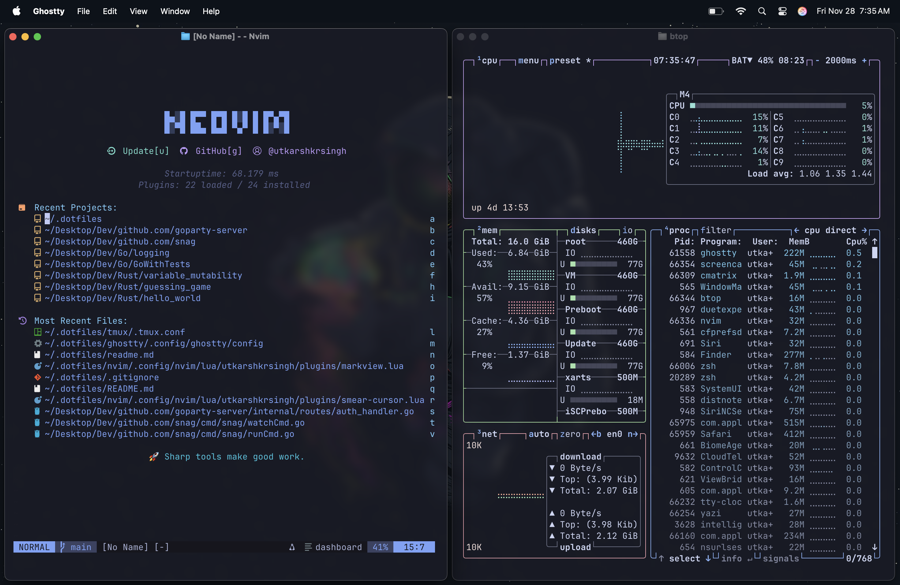
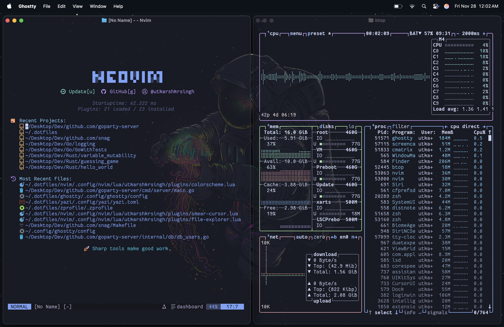

<p align="center">
  
</p>

<h1 align="center">🍎 Mac Dotfiles</h1>

<p align="center">
  Minimal, clean and productive development environment on macOS.<br>
  Configurations for <strong>Ghostty</strong>, <strong>Neovim</strong>, <strong>tmux</strong>, <strong>Starship</strong>, <strong>Yazi</strong> and more.<br>
  <strong>Focus on performance, UX and aesthetics.</strong>
</p>

---

## 📸 Screenshots

<table>
  <tr>
    <td></td>
    <td></td>
  </tr>
</table>

---

## 🧰 Features

- ✨ **Ghostty** — fast + GPU accelerated terminal
- 🧠 **Neovim** — fully configured IDE-like setup
- 🖥 **Yazi** — beautiful terminal file manager preview
- 📊 **btop** — modern resource monitor
- ⭐ **Starship** — blazing fast customizable prompt
- ⚙️ Configs organized & modular
- 🧹 Minimal fonts, icons, aesthetics & transparency
- 🔐 dotfiles structured for syncing and portability

---

## 📦 Includes Config for:

- `nvim/`
- `ghostty/`
- `tmux/`
- `yazi/`
- `btop/`
- `starship/`
- `zsh/`

---

## 🛠 Requirements

- macOS Sequoia or newer (ARM recommended)
- Homebrew
- Nerd Fonts installed (recommended: FantasqueSansM Nerd Font)
- Stow (for dotfiles management)

---

## 🚀 Setup

Clone the repo:

```bash
git clone https://github.com/<your-username>/dotfiles ~/.dotfiles
cd ~/.dotfiles
```
