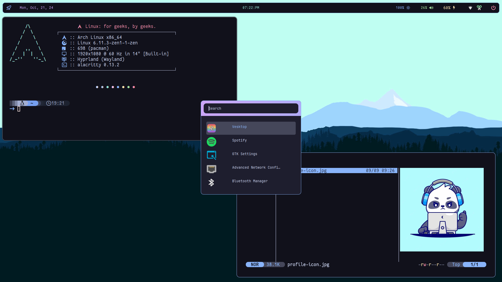
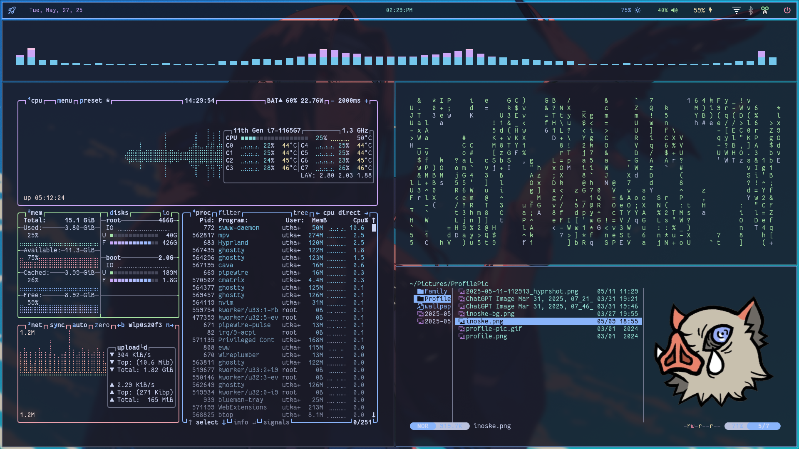
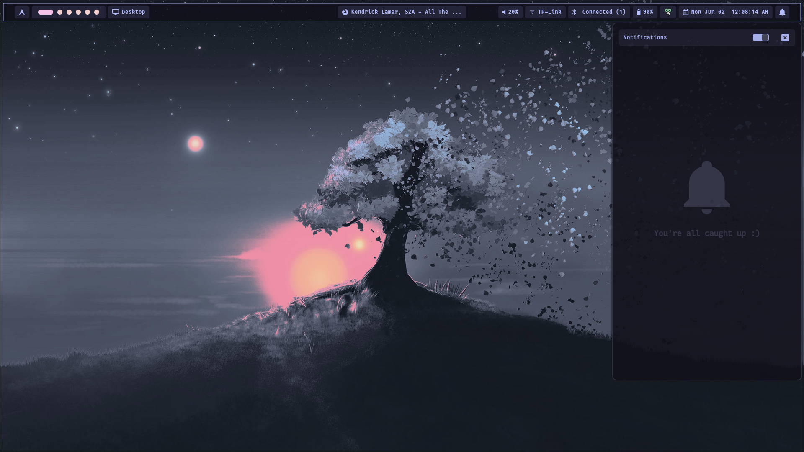
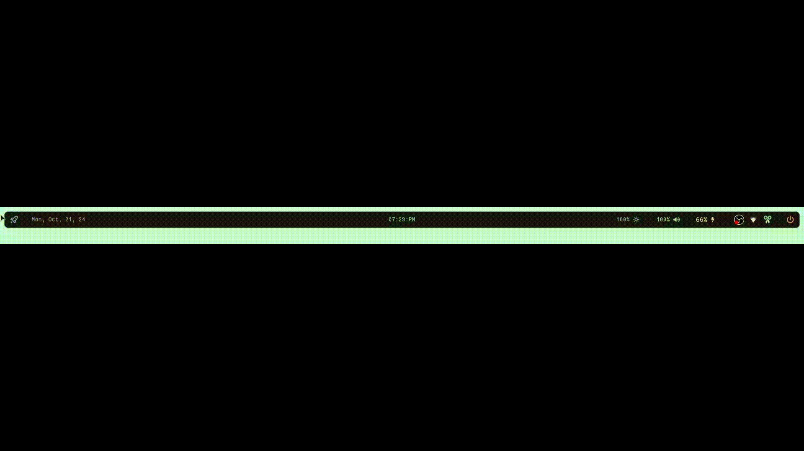

# Screenshots







---

## Installation

```bash
git clone https://utkarshkrsingh/.dotfiles.git $HOME/.dotfiles
```

#### MirrorList

To install required packaged we need to install the required mirror-lists first. For that run the script `setupMirror.sh` in the root directory of the repo.

```bash
cd $HOME/.dotfiles
chmod +x setupMirror.sh 
./setupMirror.sh
```

#### Dotfiles

To install dotfiles you can run the `setup.sh` script under the root directory of this repo.

```bash
cd $HOME/.dotfiles
chmod +x setup.sh 
./setup.sh
```

---

<p>This is by far my latest <strong>Hyprland</strong> customization for <strong>Arch Linux</strong>.<br>Thank You 😁</p>

---
