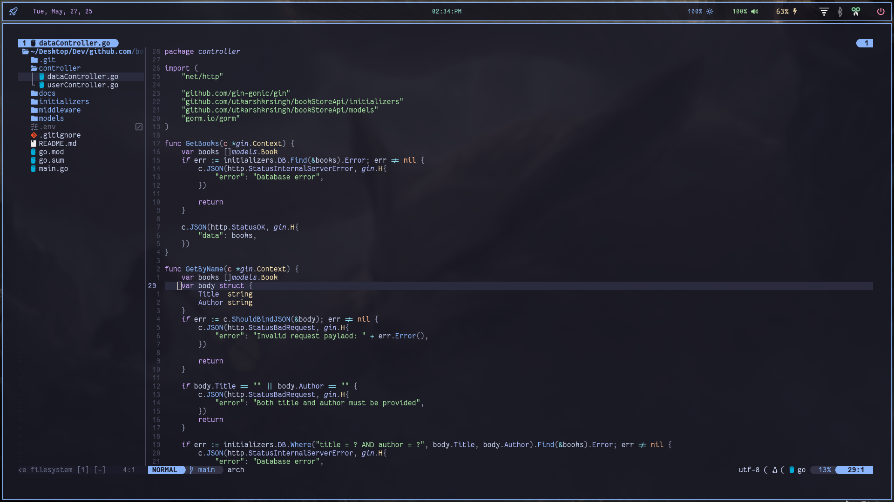

  

<h1 align="center">✨ Hyprland Dotfiles – Arch Linux Rice</h1>

  A clean, modern, and minimal desktop setup using <strong>Hyprland</strong> on <strong>Arch Linux</strong>. 
  Featuring Waybar, stylish Rofi menus, and a complete wayland environment. 
  <strong>Make your desktop beautiful and productive!</strong>

---

## 📸 Screenshots

<table>
  <tr>
    <td></td>
    <td></td>
  </tr>
  <tr>
    <td></td>
    <td></td>
  </tr>
  <tr>
    <!-- <td colspan="2" align="center"></td> -->
  </tr>
</table>

---

## 🧰 Features

- ⚡ **Hyprland** – Dynamic tiling Wayland compositor
- 🖱️ **Waybar** – System bar with widgets
- 🎨 **Rofi** – Themed launcher and emoji picker
- 🔋 Battery, date, music, and workspace widgets
- 🧪 Fastfetch for system info
- 🪟 Rounded/Pointed corners, shadows, blur & animations

---
